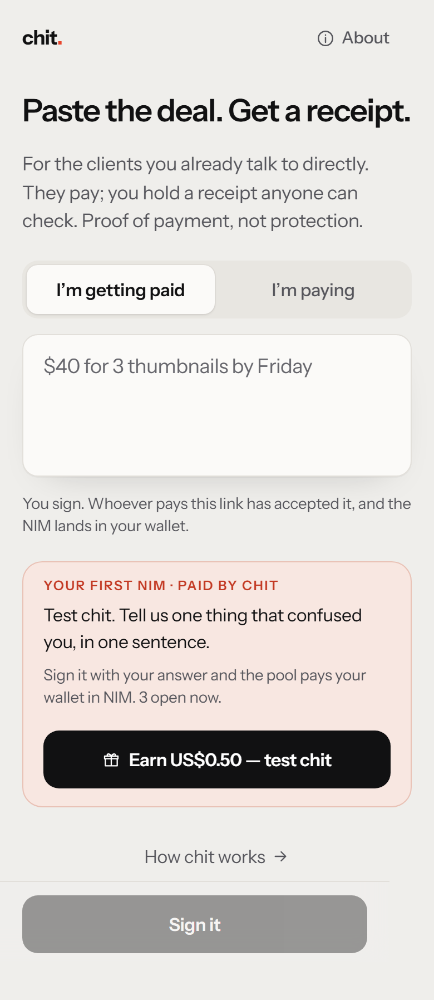
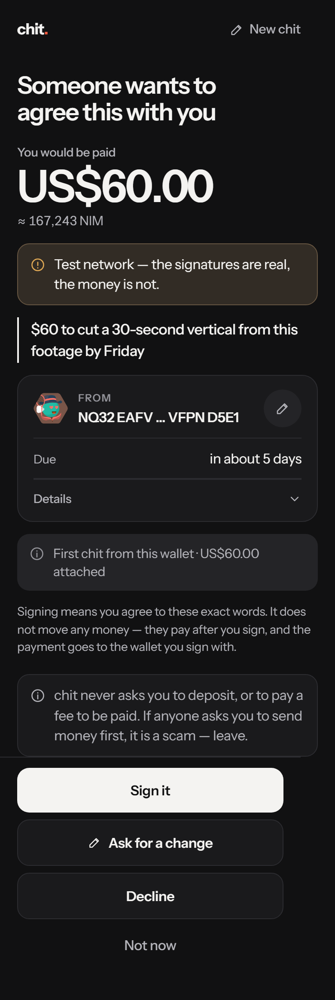
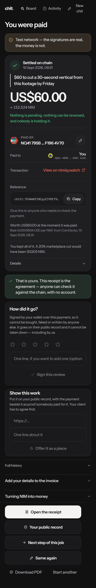
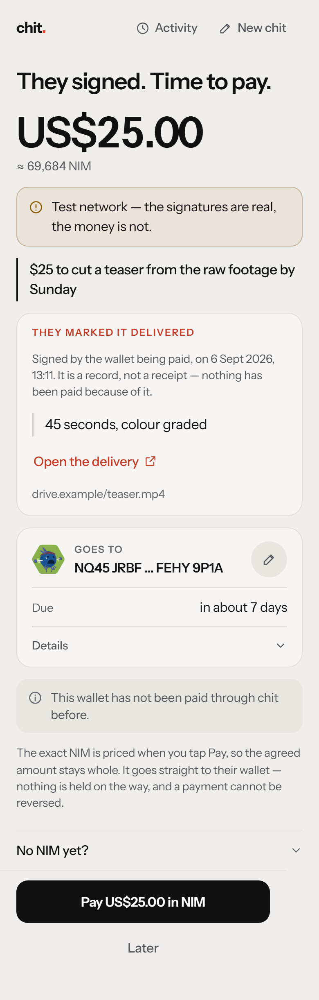
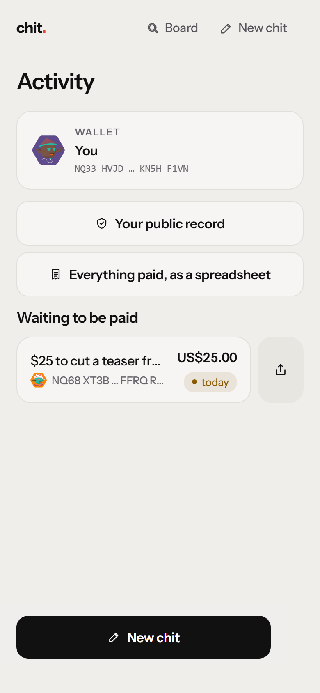
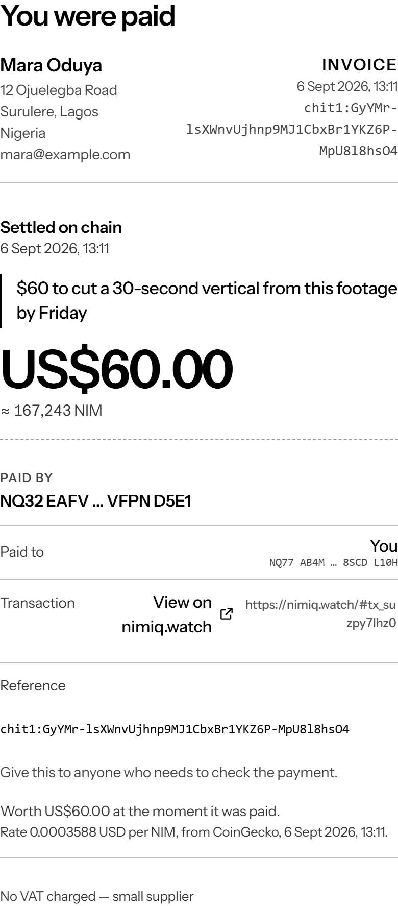
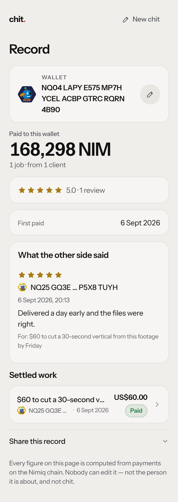
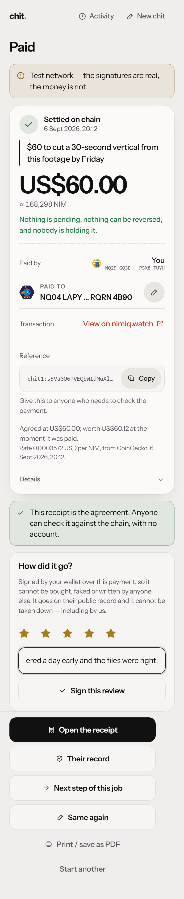
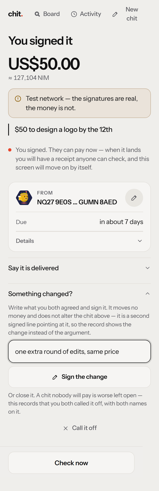

# chit

### Paste the deal you already agreed. Both sign it. The payment carries the proof.

**Live → [chit-ecru.vercel.app](https://chit-ecru.vercel.app)** · a Nimiq Pay Mini App · MIT

You agreed something in a Discord DM, a WhatsApp thread, a Fiverr message. chit turns that
one line into a signed agreement, settles it in NIM in about a second, and leaves a receipt
anyone can check — with no account, and without chit.

<p align="center">
  
  
  
</p>
<p align="center"><em>Paste it · see who is asking, and their record · hold a receipt</em></p>

---

## For a judge, in sixty seconds

1. **Open [chit-ecru.vercel.app](https://chit-ecru.vercel.app) on a phone inside Nimiq Pay.**
   No account, no signup, nothing to install beyond the wallet.
2. **Take the bounty on the first screen.** It is a real chit chit itself posts and pays:
   answer it in one sentence, sign, and the pool sends NIM to your wallet with the
   agreement's digest in the memo. That is the entire product, done once, and it is how a
   person with an empty wallet gets their first NIM. *(The pool must be funded; if its
   balance is below one payout the card says so and offers nothing.)*
3. **Or walk both sides alone.** Write a chit, tap **Try the demo worker** to have a
   labelled stand-in countersign it, pay it, and you are holding a receipt.
4. **Check the receipt without us.** Open it and your browser recomputes the digest from
   the words in the link and reads the transaction from a public Nimiq node. chit's server
   is not in that path.

On a desktop, append `?demo=1` for a mock signer. Its signatures are structurally valid and
cryptographically meaningless — they will not verify, and the app says so on screen.

---

## Why it exists

The loudest complaints in the freelance corpus are not about features. Across 533 one- and
two-star reviews of Fiverr, Upwork, Freelancer.com, Payoneer, Wise, PayPal and Deel, read
this month: **support that never answers scores 70, being locked out — verification and
login — scores 86, and fees score 37.** People are angrier about losing access to money
they earned than about the cut taken from it.

chit answers that structurally rather than with a policy page.

| The complaint | chit's answer, and why it is not a promise |
|---|---|
| Locked out of my own money | There is no account. No password, no code to your phone, no identity check — **nothing to be locked out of.** |
| Support never replies | There is nothing to escalate, because nothing is held. The failure modes are written down in the app instead. |
| The platform took 20% | **0%.** No fee is routed anywhere, which is also why chit's regulatory position is what it is. |
| I waited two weeks to withdraw | Withdrawal does not exist as a concept. The money goes wallet to wallet in about a second. |
| I delivered and was never paid | Cannot be solved by anyone without custody. chit shows the payer's record before you sign, and pays in halves if you ask. |

And the honest inverse, said on the first screen: **proof of payment, not protection.**
chit cannot escrow, cannot reverse a payment, and cannot arbitrate. Anyone who tells a
freelancer otherwise on this rail is selling something.

---

## How it works

```
paste the line  →  check what we understood  →  sign  →  send the link
                                                            ↓
        receipt  ←  payment settles on chain  ←  pay  ←  they countersign
```

**Both directions, freelancer first.** *I'm getting paid* makes a **quote**: the worker
signs the scope alone, puts the link where the client is, and whoever pays it first is the
client. Paying is accepting — there is no countersign step, and the payer is recorded from
the transaction rather than from a form. *I'm paying* makes an open chit the worker
countersigns.

**The payment carries the agreement.** The canonical text is hashed; that hash is the
64-byte memo of the NIM transaction. So the money and the words are one object: a client
cannot accept work without the payment existing, and cannot later deny having accepted
work they demonstrably paid for.

**Nobody types an address.** On an open chit the countersignature supplies the worker's
address, derived from the key that signed it; on a quote the payment supplies the client's.
Nothing is copied between apps, and nothing can redirect the payment.

**Settlement is observed, never asserted.** A transaction settles a chit only if it carries
the digest **and** pays the named address **and** clears 97% of the signed amount. A memo
alone settles nothing; a one-Luna payment carrying a public digest is recorded as a
mismatch, not a payment. The party with an interest in claiming payment happened is never
the party asked.

**The record is computed, never written.** Before signing, a worker sees the payer's
history — how many chits paid, how fast, how many signed and left unpaid past the deadline.
A new wallet reads as *new*, never as bad. Every number derives from settled payments and
can be recomputed by anyone from the transaction hashes.

### The whole deal, not just the payment

| | |
|---|---|
| **Counter-offer** | Answer a chit with a chit. The composer opens with the words, the amount and the direction already in it, pointed back at what it answers. |
| **Half up front** | One chip halves the number *and* rewrites the sentence, because the sentence is what both sides sign. Offered, never insisted on — the same threads that ask for deposits warn that demanding one loses first projects. |
| **Delivered** | The party being paid signs *here it is*, with a link to wherever the work lives. It moves no money and obliges nobody; the payer sees it before deciding. |
| **The other half** | A settled deposit offers its second half, and any settled chit offers the next step of the job. |
| **Waiting to be paid** | Activity leads with who owes you and for how long, with one tap to chase them — there are no reminders on this platform, so the person owed is the only thing that can. |
| **An invoice** | The receipt prints as one, with details typed once and kept on the device. |
| **A signed review** | After a payment, either side can rate the other over the settling transaction. No payment, no review — so there is nothing to farm and nothing worth buying. |
| **A change, or a cancel** | The scope moved, or the job is off. Both are a chit with no money in it, signed by both, pointing at the one they answer. Nothing about the original is altered. |
| **A public record** | One link a freelancer sends instead of a marketplace profile. Nothing on it is writable by its subject. |
| **A spreadsheet** | Every settled chit as CSV — date, line, role, amount, NIM received, counterparty, transaction. The one thing everybody wants from a platform once a year. |

<p align="center">
  
  
  
</p>
<p align="center"><em>Delivered, before you pay · who owes you · the same receipt, printed</em></p>

### The receipt is the product

It leads with the words, then the amount, and says the thing no fiat receipt can: *nothing
is pending, nothing can be reversed, and nobody is holding it.* It carries a reference to
quote, what the payment **actually** carried — not only what was agreed, since settlement
accepts 97% and upwards — and what that was worth in fiat **at the moment it landed**, which
is the figure the IRS (FAQ Q27) and HMRC (CRYPTO10400) key on, with the rate, its source and
its timestamp.

Printed, it becomes an invoice. Most chits sit inside the small-invoice reliefs — Germany's
§33 UStDV at €250, the UK's VAT Notice 700 §16.6.1 at £250 — which need the supplier's name
and address, the date, the service and the total with a tax note. chit already had three of
those four; the fourth is typed once into `localStorage` and **never sent to the server,
never put in a chit, never shown to the other side.** The test suite asserts all three.

### The record is a page, and the page is the growth loop

A marketplace rating is a row in that marketplace's database. It is why leaving one costs a
freelancer years of work, why a suspended account takes the reputation with it, and why
five-star accounts are worth buying — the seller is selling somebody else's rows.

`/p/<address>` is the same thing without the row. Total paid, from how many distinct
clients, the settled work itself, and the reviews — each signed by one of the two parties
over the hash of the transaction that paid for it. Three properties fall out of that
binding, and none of them is a policy:

1. **No payment, no review.** The hash has to be the one the chain recorded for that chit.
2. **Only the two parties may write one**, because the signature must verify against the
   payer's key or the worker's, and the server derives who those are rather than believing
   the request.
3. **It survives chit.** Signature, public key and canonical text are enough for anyone to
   re-check it with an off-the-shelf Ed25519 library.

There is no bio, no headline, no gig list and no badge. A page its owner can write on is a
page a stranger has to discount, and the whole value here is that they do not have to. It
is also the only link in the product somebody has a reason to send to a person who has
never heard of chit — which matters more than usual, because there is no discovery inside
Nimiq Pay at all.

<p align="center">
  
  
  
</p>
<p align="center"><em>The record you send instead of a profile · a review bound to a payment · the scope changed</em></p>

---

## Nimiq, load-bearing

Not a payment button bolted on. The chain is what makes the product possible.

| Used | For what |
|---|---|
| `sign()` | The agreement itself. Both parties sign the identical canonical text; the digest of it is the product. |
| `sendBasicTransactionWithData()` | The payment **is** the acceptance, because its 64-byte memo is that digest. |
| `listAccounts()` | Identity. Requested on a tap, never on load. |
| `getBlockNumber()` | Deadlines are block heights, so they are checkable against the chain rather than against a server clock. Also the mainnet/testnet guard. |
| `isConsensusEstablished()` | Bounded, and never blocking. |
| `requestDeviceIdentifier()` | Keeps the bounty fair — one payout per device per day — without a login. |
| `getHostLanguage()` | All five languages the platform ships — English, German, Spanish, French, Portuguese — at the host's own preference. Each dictionary is its own chunk, so nobody downloads four they cannot read. |
| `@nimiq/identicons` | Every wallet wears the same face it wears everywhere else in Nimiq. |
| `@nimiq/utils` historic rates | What the payment was worth when it landed. |
| Public RPC, from the browser | The verify page reads the chain **directly**, so a receipt outlives chit. |

**Feeless is not a detail here.** A $0.50 bounty and a $3 chit are ordinary on this rail and
structurally impossible on card rails, whose floor is about 30¢. And a 20% cut is not
undercut by a smaller cut — it is removed.

---

## Verify it yourself

Nothing below is a claim about intent; each is a command.

```bash
npm install
npm test          # core 94 · verify 22 · api 93 (+1 needs a blob token) · web 44
npm run typecheck # four packages, strict, exactOptionalPropertyTypes
npm run build
```

```bash
# Two people, two browsers, two real Ed25519 keys, the whole product end to end.
# 201 checks. Writes every screen to shots/ and asserts each fits a 390px phone.
node --experimental-strip-types scripts/user-journey.mjs

# The live deployment, in a real browser. 21 checks.
node --experimental-strip-types scripts/live-visual.mjs

# Contrast, type scale, tap targets and dead space, measured rather than judged.
node scripts/design-metrics.mjs
```

The journey is not a unit test. It runs the real bundle, the real API, real SQLite, the
real settlement watcher and the live rate; only the chain's *contents* are substituted,
over real HTTP in the real response shape, because a test cannot mine a block. Every
screen asserts zero console errors and zero failed requests from chit's own origin.

**The signature scheme is pinned to Nimiq's own test vectors.** A local test of a signing
scheme proves nothing — both sides use the same implementation, so it agrees with itself
and can still be wrong on a real phone. So `packages/verify/test/keyguard-vectors.test.ts`
asserts chit's digest against the two vectors published in `nimiq/keyguard`'s own
`Key.spec.js`, using **Node's** SHA-256 rather than `@nimiq/core`'s, so the two
implementations are genuinely independent.

---

## Where it runs

Two shapes behind one storage interface; the routes cannot tell which.

| | Self-hosted | Serverless (the live deployment) |
|---|---|---|
| Storage | SQLite on disk | object store, keyed by digest |
| Settlement | a watcher sweeps open chits | confirmed while answering a read of that chit |
| Atomicity | conditional `UPDATE`, genuinely atomic | read-then-write, guarded |

Confirming on read is not a downgrade: in the moment that matters — the payer has just
paid and both screens are polling — it runs every couple of seconds, tighter than any
sweep. When nobody is looking, nothing needs to be known.

Both back-ends are held to **one contract** and run as one suite against each
(`apps/api/test/repository.test.ts`), with the object-store half against the real store
over the network rather than a fake. That suite paid for itself immediately: it caught that
a freelancer's activity list matched only `payer`/`payee`, so it never showed the work they
had actually countersigned.

---

## Layout

| Package | What it is |
|---|---|
| `packages/core` | The frozen foundation. Canonical form, digest, delivery form, signature normaliser, terms parser, wallet tiers. No dependency on a browser, a server or a wallet. |
| `packages/verify` | Real Ed25519 verification and address derivation. Separate because it pulls a WASM bundle that has no business on a phone. |
| `apps/api` | Chit lifecycle, both storage back-ends, settlement, rate quotes, the bounty, abuse controls. |
| `apps/web` | Twenty-two screens, no framework. **115 kB of JavaScript, 40 kB gzipped**, with the identicon library and each of the four translations as lazy chunks nobody pays for unless they need them. |

chit has **no CSS dependency**. It had one — `nimiq-css` — until that package was found to
publish **no licence at all** (`npm view nimiq-css license` returns nothing; its repository
reports `license: null`) while being compiled into a submission that must be MIT. Removing
it also fixed two defects it caused: it hid every empty `<span>`, which had silently erased
the status dot, the identicon disc and the busy spinner, and on touch devices it grew every
link and button by 16px on all sides, so stacked buttons overlapped by 32px.

---

## The bounty

The first card is a real chit chit posts and pays: *"Test chit. Tell us one thing that
confused you, in one sentence."* Answer it, sign, and the pool sends ~$0.50 in NIM to that
wallet with the digest in the memo. It is the organiser's own request for this cycle —
*earn NIM by testing Mini Apps* — built as the front door rather than as a faucet, and
these rules are what keep it one:

- **Real work, machine-checked, no chance anywhere.** At least four words, no links, and
  genuinely new — character trigrams are compared against every prior answer. Arrival order
  decides only who was first.
- **Hard limits.** One payout per device per day, one per wallet per day, and a daily NIM
  ceiling the key cannot exceed.
- **Everything public** at [`/bounty`](https://chit-ecru.vercel.app/bounty): the pool
  address, its live balance, every payout with its transaction and the line that earned it.
- **Nothing offered that cannot be paid.** Below one payout's balance, the card says so and
  no claim is accepted.

**chit pays its own bounty and never holds anyone else's money.** A labelled *demo worker*
exists for the same reason: so one person can walk the entire flow alone.

---

## Things that are true and easy to get wrong

Each cost real time to establish. Written down so nobody has to find them twice.

**The chain trap.** `sign()` has no domain separation and no expiry, so a testnet signature
verifies byte-for-byte on mainnet. The chain and a nonce are therefore *inside* the signed
bytes, and the service refuses to start with `CHIT_CHAIN=test` against a mainnet RPC.

**The byte-length trap.** The digest is
`SHA-256("\x16Nimiq Signed Message:\n" ‖ decimal(byteLength) ‖ message)`, and that length is
the UTF-8 **byte** length. The Hub's published snippet uses `message.length` — UTF-16 code
units — which is silently right for ASCII and wrong for `café`, `€40` or any emoji. Pinned
by test, including a string where the two counts differ.

**`sign()` frames differently by host.** chit normalises hex, base64, base64url,
`Uint8Array`, `number[]` and numeric-keyed objects, using byte length to disambiguate
rather than guessing.

**`sign()` and `listAccounts()` resolve with an error object** as well as rejecting. The
docs describe only the throw. Both happen; both are handled.

**The memo field is 64 bytes**, measured at 64 accepted / 65 `Overflow`. `chit1:` plus a
base64url SHA-256 is 49. Hex would not have fitted.

**The memo arrives under two names** — `recipientData` over JSON-RPC, `data.raw` via the web
client. Normalise both or settlement silently never fires for one source.

**Money never touches a float.** Integer minor units end to end, stored as TEXT because
JavaScript loses precision reading a large SQLite INTEGER back. Fiat converts to Luna in
scaled integer arithmetic, rounding **up**, so a chit is never a Luna short.

**`@nimiq/utils` defaults to a price provider that now needs an API key.** chit uses
CoinGecko, so a fresh deployment needs no credential to obtain, lose or leak.

---

## Things an object store will not do for you

Measured against the real service, not assumed.

- **A write is not immediately readable.** A read straight after a create can come back
  empty and succeed a moment later. Paths that expect a chit retry briefly; `create`'s
  existence check deliberately does not, because there a miss is the normal case.
- **Nor is an overwrite.** A read after an update can return the previous body — which
  surfaced as a settled chit whose history was missing its `settled` event. Records carry a
  monotonic revision and a local copy is used **only when strictly newer**, so it can
  accelerate a stale read and never serve one.
- **Listings lag further**, so nothing on the critical path uses one.
- **`put` renames your file by default.** `addRandomSuffix` is on unless disabled, so
  `put('chits/<id>.json')` lands at `chits/<id>-a8f3kd.json` and the read finds nothing.
- **Two writers still race.** There is no compare-and-swap, so the self-hosted SQLite
  deployment remains the reference one.

---

## The one thing this audience asks for that is not here

The two largest design threads in the review corpus — 151 and 120 comments — are the same
complaint: *the client wants to see the work before paying, and once they have seen it the
urgency disappears.* The top answers in both, at +529 and +467, are also the same:

> "upon receipt of payment, the watermark will be removed" · "hold them until they pay"

chit does not do that, and it is the most-wanted thing in the whole sample. It is named here
rather than left to be found, because the reasoning is a decision and not an oversight.

It needs **storage and a key, not custody** — encrypt on the phone, upload only ciphertext,
release the key when settlement is observed. That is a much lower bar than escrow, and the
design already exists in `PRODUCT_SPEC.md` §3a and §6. The honest cost is that chit would
hold a key, which would have to be said plainly and could never be called trustless. It is a
new surface in a cycle that scores complexity down, so it is the first thing after this one
rather than a rushed part of it.

**What is refused permanently, and why** — a gap a judge finds unspoken is a miss; the same
gap named is a decision:

| | |
|---|---|
| Escrow, disputes, refunds | All need custody or something on chain to enforce against. The honest substitutes are the payer's record, smaller increments, and saying *final* above every Pay button. |
| Push reminders | The platform has none. Activity leads with who owes you instead, and never promises a notification. |
| KYC, or any account | The loudest complaint in the corpus is being locked out. There is deliberately nothing to be locked out of. |
| File storage | Links only. Storage is a different product with a different liability — which is exactly what the sealed master above would change. |
| Pay-to-apply, bidding credits | Refused permanently. It is the mechanic this audience hates most. |
| A job board | Distribution cannot be beaten inside one cycle. chit is for the client you already have. |

---

## What is not proven

Honest limits. Everything here needs a physical device or funds.

- **The `nimiqpay://` deep link opening a full path on a real phone.** Both official link
  forms exist in the code; measured this month, the `https://nimpay.app/miniapps/open/…`
  route answers `404 Unknown mini app host` for chit *and for three of four catalog-listed
  apps*, so phones are given the scheme link and their own store's listing instead.
- **A funded key's broadcast being mined.** An unfunded signed transaction with a 49-byte
  memo was built in Node and **accepted** by the public RPC (`scripts/payout-probe.mjs`).
  The last inch needs a few NIM on a throwaway key.
- **The explorer link format.** `nimiq.watch/#<hash>`; the fragment form is unverified for
  Albatross hashes and lives in one function.
- **Nimiq Pay's own payment sheet.** The provider's source was read
  (`nimiq/trust-web3-provider`, branch `nimiq`) and the signer's vectors are pinned, but the
  app binary is closed and the sheet's own UI was not seen.
- **The Android file picker and camera**, host-gated.
- **The Spanish, French and Portuguese copy has not been read by a native speaker.** It is complete, tested for missing keys, stale keys, dropped placeholders and untranslated leftovers, and written rather than machine-generated — but that is not the same as reviewed.
- **Arc mainnet.** Every reference found was testnet, which is why the word *escrow* appears
  nowhere in the product.

The in-memory rate limiter is per-process: it resets on deploy and does not span replicas.
On more than one instance it must move to shared storage or the effective limit multiplies.

---

## Licence

MIT — see [`LICENSE`](LICENSE). Built for the Nimiq Mini Apps Competition, Cycle 2, 2026.
